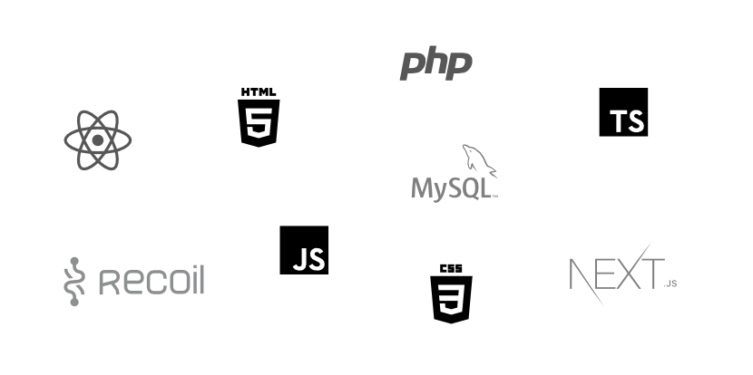

# Code Portfolio – Example apps

- [About](#about)
- [Use](#how-to-use)
- [Notes](#notes)

---

## About

Source of inspiration for new projects:

A collective 'behind the scenes' portfolio showcase to accompany other visual and live demo references.

Any code shown here has been based on specific requirements and problems to be solved at that time.

---

## How to use

Review the code quality from a Developer's perspective.

This is about the tech stack, code quality, and architectural solutions.

Code has been grouped into the primary stack. For all projects, this also includes HTML 5 and CSS 3/X.

Projects have been created over a range of years and under different circumstances (e.g., budget, deadline, tooling ecosystem, standards).

---

## Notes

> These are stripped down and non functional sources. The code can't be installed or run. An IDE likely shows errors due to missing resources.

_Due to the nature of this being a static code demo, functionality was not a concern. While preparing these files, it's likely that some syntax errors might have appeared. The code has been automatically 'prettified', but not checked afterwards._
